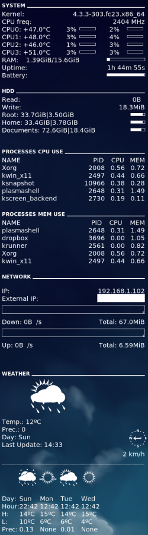

Conky
=====
This repository provides a public copy of my conky configuration. There are
instructions bellow to make your own configuration in less than 5 minutes.



How do I set this up?
---------------------

First you have to install conky in your distro.

```sh
# dnf install -y conky
```

and some dependencies for this project:

```sh
$ pip install python-dateutil
# or
# dnf install -y python-dateutil
```

conky_config.sample
-------------------

The `conky_config.sample` is just a template. To make it your own, you just have
adjust some environment variables to create your own configuration file.

If you use an external HDD and you want to see it in you conky when you plug it,
set the environment variable `HDD_PATH` with your HDD's mounting point, for
example:

```sh
export HDD_PATH="/run/media/external_disk"
```

If you don't use any external HDD set the environment variable `COMMENT` with
`#`:

```sh
export COMMENT="#"
```

Set the path where you will put your configuration files, including the
`signal.sh` file, and create that directory.

```sh
$ export CONKY_PATH=$HOME/.conky
$ mkdir -p ${CONKY_PATH}
```

Finally, run the following command with the variables that you have set.

```sh
$ envsubst '$CONKY_PATH,$COMMENT' < conky_config.sample > conky_config
$ # Or this one
$ envsubst '$CONKY_PATH,$HDD_PATH' < conky_config.sample > conky_config
```

Open your conky_config and check if it is correctly written.

If you use a 3G bundle you can try and see if the `signal.sh` script gives
any value for the 3G bundle signal. If it doesn't, you can remove line 156 from
`conky_config` file.

If you use Nvidia Drivers (oficial drivers) uncomment lines 107-110.

weather_update.py
-----------------
This is a small python script to download weather data from openweathermap.org.

It is necessary to register in order to get you API ID, for more info see here: 
http://openweathermap.org/appid

You can find your city's ID by searching in:
http://openweathermap.org/find?q=

You will need to change lines 35 and 36 in order for this script work.

fonts/
-----
I can't remember from where I have downloaded these fonts. I didn't create any
of them and unfortunately I don't know who the author is. They are fundamental
for conky weather output to be pretty.

To install those fonts just copy them to `${HOME}/.fonts` directory and should
be sufficient.

All done, I want to see pretty things!
--------------------------------------

Just copy `signal.sh`, `weather_update.py` and `conky_config` to your
`${CONKY_PATH}` directory.

Then run the following command `conky -c ${CONKY_PATH}/conky_config` and
you'll be able to see something similar to the image above. If not, don't be
afraid on changing some numbers in that configuration since many of them just
represent coordinates.